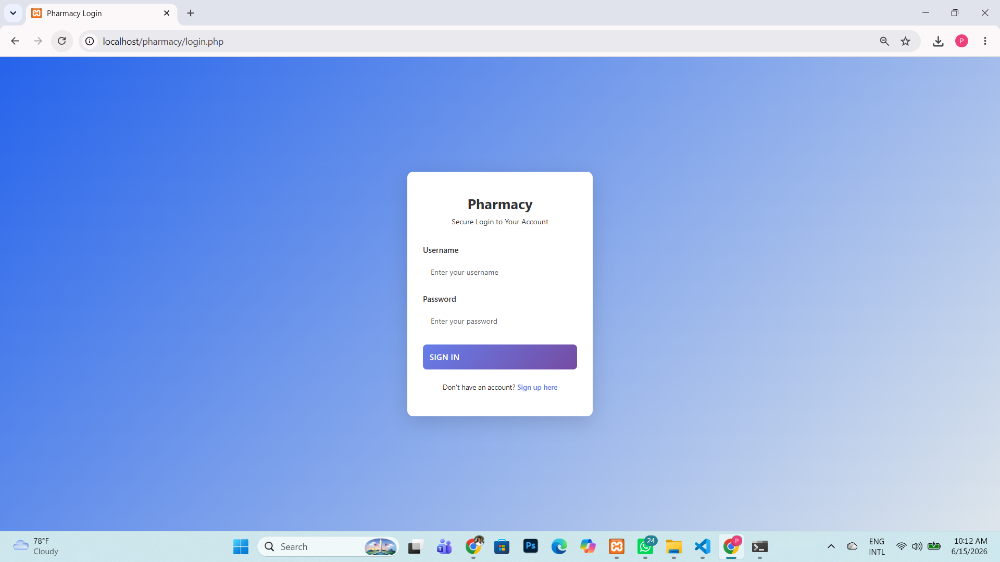
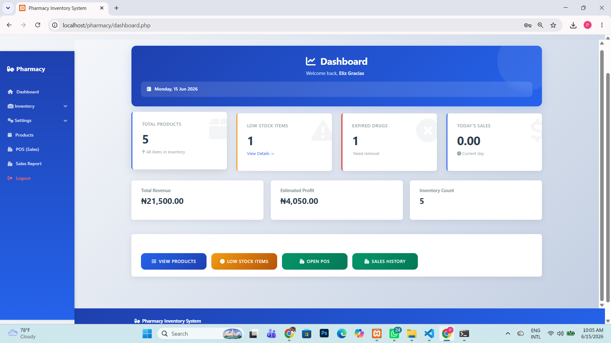
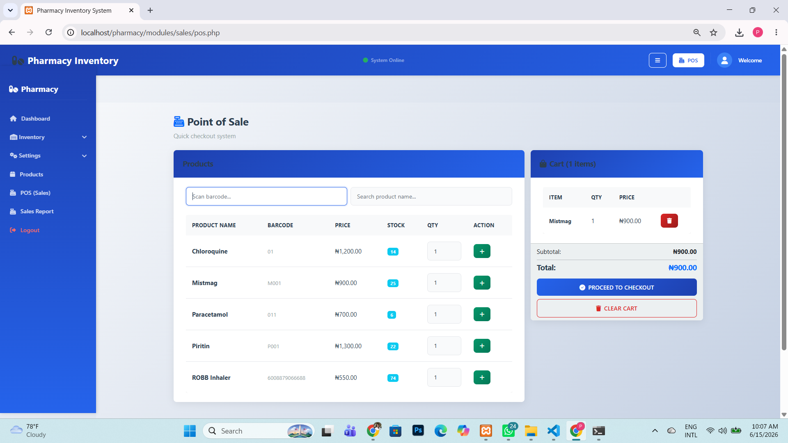

# Pharmacy Inventory System

A web-based Pharmacy Inventory Management System designed to help pharmacies manage medicines, monitor stock levels, track expiry dates, and record sales efficiently.

## Features

- User Authentication
- Dashboard Analytics
- Product Management
- Inventory Tracking
- Low Stock Alerts
- Expired Drug Monitoring
- Point of Sale (POS)
- Sales Reporting
- Revenue Tracking

## Technology Stack

- PHP
- MySQL
- HTML5
- CSS3
- JavaScript
- Bootstrap

## Screenshots

### Login Page



### Dashboard



### Medicines


### Sales



### Expiry Alerts


## Installation


## Installation

1. Clone repository

```bash
git clone https://github.com/phirstlady-design/pharmacy-inventory-system.git
```

2. Import database:

```text
pharmacy_inventory.sql
```

3. Configure database connection

```php
$conn = mysqli_connect(
    'localhost',
    'your_db_user',
    'your_db_password',
    'your_database'
);
```

4. Run using XAMPP or any PHP server.

## Author

Fiponmile Mary